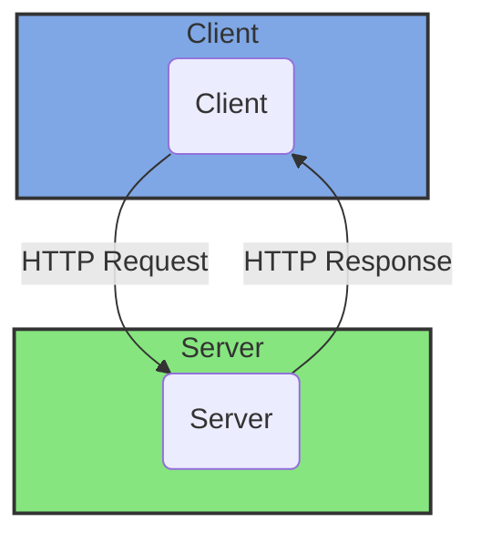

# Client-Server

### Definition

Client-server architecture is a computing model in which a central server provides resources and services to multiple client devices. The server is responsible for processing requests, managing data storage, and enforcing security, while the client devices, such as computers or mobile devices, interact with the server to access and utilize those resources.

### Advantages

* **Scalability**: Client-server architecture allows for distributed processing, allowing the server to handle multiple client connections and scale up resources as needed.
* **Centralized management**: By centralizing resources and data on the server, administrators can manage security, access controls, and updates more efficiently.
* **Resource sharing**: Server resources, such as databases or files, can be shared among multiple clients, reducing redundancy and improving efficiency.
* **Enhanced security**: Centralized security measures on the server can help enforce access controls, protect against unauthorized access, and ensure data integrity.

### Disadvantages

* **Single point of failure**: If the server fails or experiences downtime, all connected clients will be unable to access resources or services.
* **Network dependency**: The performance and reliability of the client-server architecture heavily rely on the quality and stability of the network connection between the client devices and the server.
* **Scalability limitations**: While the server can handle multiple client connections, there may be limitations to the number of concurrent connections or the capacity of the server to handle intensive workloads.
* **Increased complexity**: The server and client interactions introduce additional complexity, requiring protocol implementation and potentially necessitating more sophisticated development and maintenance.
* **Potential bottlenecks**: A heavily utilized server may experience performance bottlenecks due to the high volume of client requests.

### Suitable Use Cases

* Applications that require centralized data management and storage, such as inventory management systems or banking systems.
* Applications that require secure access control or enforcing specific business rules, such as authentication or authorization systems.
* Systems that need to handle multiple concurrent users, such as web applications or online collaboration tools.
* Client devices with limited processing power or storage capacity that can leverage server resources for computation or data storage.

### Non-suitable Use Cases

* Applications that require real-time or highly responsive interactions, as network latency can introduce delays in the client-server communication.
* Small-scale applications with a limited number of users or simple requirements that do not justify the overhead of the client-server architecture.
* Applications that need to function in offline or disconnected scenarios, as client-server architecture typically relies on a network connection.
* Situations where strict control over data privacy and security is a concern and a decentralized architecture may be preferred.
