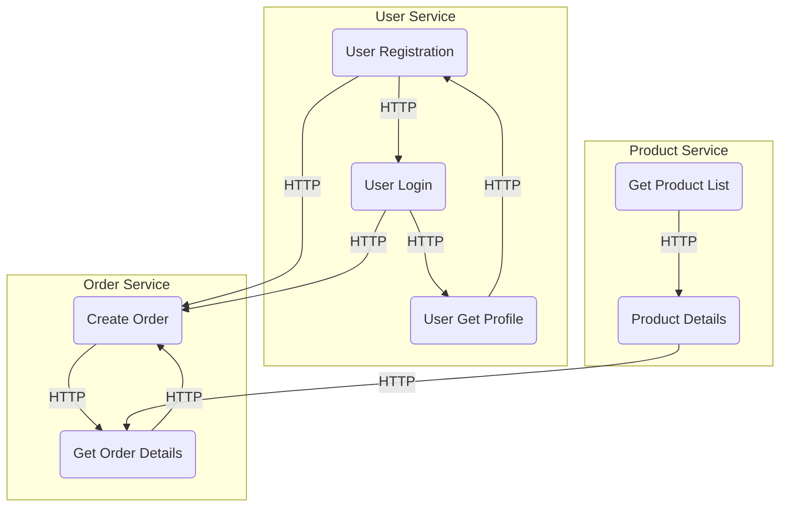

# Microservices

### Definition

Microservices architecture is an architectural style that structures an application as a collection of small, independent services that can be developed, deployed, and scaled independently of each other. Each service is responsible for a specific business capability and can be developed using different technologies and programming languages. Communication between services is typically done through lightweight protocols such as HTTP or messaging queues.

### Advantages

* **Scalability**: Microservices architecture allows each service to be independently scaled to handle specific demands, resulting in better performance and resource utilization.
* **Flexibility**: Since each service is developed and deployed independently, teams can choose the most appropriate technology stack for their specific service, enabling faster innovation and evolution.
* **Resilience**: A failure in one microservice does not bring down the entire system. Services can be designed to handle failures gracefully and continue to operate, reducing the impact of failures.
* **Easy to understand and maintain**: Each microservice focuses on a specific business capability, making it easier to understand, develop, test, and maintain.
* **Enhanced deployment and release cycles**: With independent services, updates, and deployments can be done without affecting other services, resulting in faster release cycles and continuous delivery.

### Disadvantages

* **Increased complexity**: Coordinating communication between services, managing inter-service dependencies, and ensuring overall system integrity can be challenging and complex.
* **Distributed system challenges**: Dealing with network latency, service discovery, and maintaining data consistency across multiple services require additional effort and infrastructure.
* **Operational overhead**: Managing and monitoring multiple services, ensuring high availability, and handling system-wide events can add complexity to the operational side of the architecture.
* **Integration testing**: Testing the interactions between multiple services and ensuring proper functionality can be more complex and time-consuming compared to monolithic architectures.
* **Increased overhead**: Each service requires its own infrastructure, deployment, and maintenance, resulting in increased operational overhead and costs.

### Suitable use cases

* Large and complex systems need to be divided into manageable components.
* Agile development environments where teams can independently develop and deploy services.
* Applications with varying scalability requirements where specific services can be scaled up or down based on demand.
* Applications that require frequent updates and continuous delivery practices.

### Non-suitable use cases

* Small and simple applications that do not require the complexity of a microservices architecture.
* Applications with strict performance requirements, as the overhead of communication between services can impact performance.
* Applications heavily reliant on synchronous communication, as this can introduce latency and impact user experience.
* Organizations with limited resources and expertise to manage and maintain multiple services.
