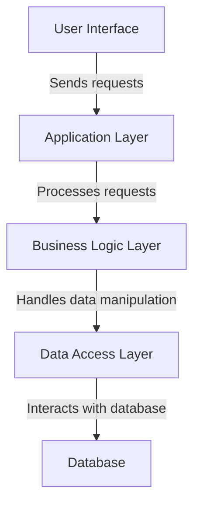

# Layered Architecture

### Definition

Layered architecture is a software architectural pattern that divides an application into layers, with each layer responsible for a specific set of functionalities. Each layer in the architecture depends on the layer beneath it and provides services to the layer above it.

### **Advantages**

* **Modularity:** Layered architecture promotes modularity by separating different concerns into distinct layers, making it easier to understand, develop, and maintain the application.
* **Separation of concerns:** Each layer has a specific responsibility, such as presentation, business logic, and data access, allowing for better separation of concerns and easier maintenance.
* **Reusability:** Layers can be reused across different applications or projects, as they represent modules with well-defined interfaces and functionalities.
* **Scalability:** Layers can be scaled independently based on the specific requirements and demands of each layer, allowing for better scalability and performance optimization.
* **Testability:** Layered architectures facilitate unit testing as each layer can be tested independently without dependencies on other layers.

### **Disadvantages**

* **Overhead:** The use of multiple layers can introduce additional overhead in terms of performance and complexity, especially if the layers are not well-designed or the communication between layers is inefficient.
* **Lack of flexibility:** In some cases, adding or modifying functionality may require changes in multiple layers, making the architecture less flexible compared to other patterns.
* **Tight coupling:** Layers are tightly coupled with each other, and changes in one layer can potentially impact multiple layers, leading to maintenance challenges.
* **Performance impact:** The communication and data transfer between layers can potentially impact the performance of the application, especially if there are excessive interactions between layers.

### **Suitable Use Cases**

* **Large-scale applications:** Layered architecture is well-suited for large-scale applications with complex functionalities, where modularity, separation of concerns, and scalability are vital.
* **Applications with changing requirements:** Layered architecture allows for easier modification and extension of specific layers due to the separation of concerns, making it suitable for applications with evolving requirements.
* **Distributed systems:** Layered architecture can be applied in distributed systems where the application is divided into distributed layers running on different nodes.

### **Non-suitable Use Cases**

* **Small and simple applications:** Layered architecture may introduce unnecessary complexity for small and simple applications that do not have complex functionalities or changing requirements.
* **Real-time systems:** Layered architecture may not be suitable for applications that require real-time processing and immediate response as the communication between layers can introduce latency.
* **Performance-critical systems:** If the application requires maximum performance and minimal overhead, layered architecture may not be the best choice as it adds additional layers of abstraction and communication overhead.
