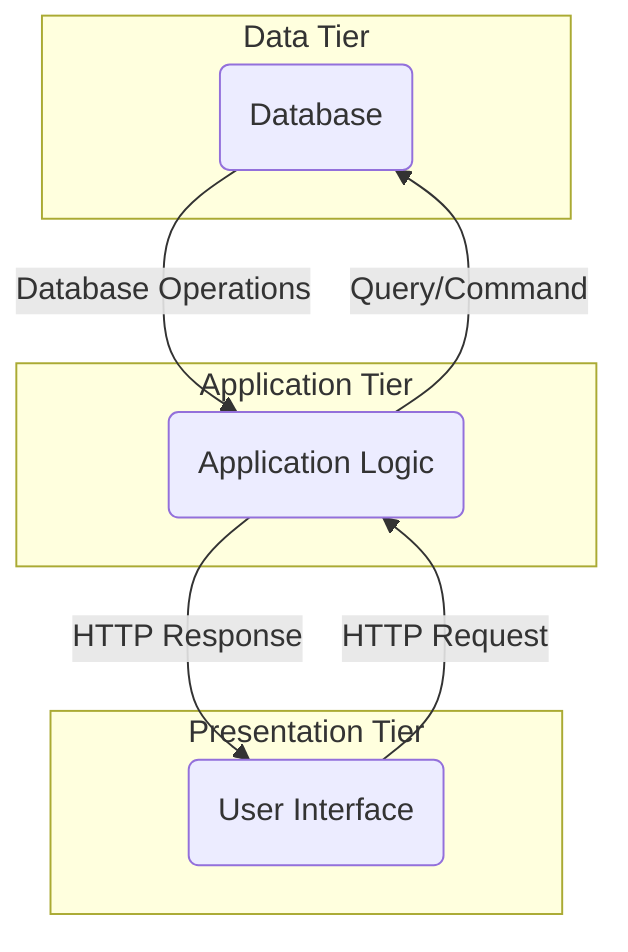

# N-Tier

### Definition

N-Tier architecture, also known as multi-tier architecture, is a software design pattern that separates an application into multiple layers or tiers, with each tier responsible for a specific set of functions. This architectural style helps to improve code organization, reusability, scalability, and maintainability by dividing the application into logical components.

### Advantages

* **Modularity**: N-Tier architecture allows for the separation of concerns, with each tier having a specific responsibility. This makes the code more modular and easier to maintain, test, and extend.
* **Scalability**: Each tier can be scaled independently, allowing for better performance as the application grows and user load increases. For example, the database tier can be scaled separately from the presentation tier.
* **Reusability**: The separation of layers promotes code reuse. Common functionalities, such as authentication or data access, can be implemented once and reused across multiple tiers.
* **Flexibility**: N-Tier architecture provides flexibility in terms of technology choices for each tier. Different tiers can be developed using different languages, frameworks, or technologies as per the specific requirements.
* **Security**: By placing the database and business logic tiers behind a firewall, it helps to enhance application security by preventing direct access to sensitive data.

### Disadvantages

* **Complexity**: N-Tier architecture can introduce complexity, especially when dealing with communication between tiers. Extra effort and planning are required to ensure proper integration and interaction between the layers.
* **Performance impact**: The communication between tiers can introduce latency and overhead, which can impact the overall performance of the application. Careful design and optimization are needed to mitigate performance issues.
* **Increased development time**: Implementing an N-Tier architecture requires more time and effort during the development phase due to the additional layers and communication mechanisms that need to be implemented.
* **Deployment complexity**: Deploying an N-Tier application involves deploying multiple components in different environments, which can increase the complexity of deployment and maintenance.
* **Learning curve**: Developers may need to have a solid understanding of the architecture and its components to effectively design, develop, and maintain an N-Tier application.

### Suitable Use Cases

* Large-scale enterprise applications that require separation of concerns and flexibility in scaling different tiers independently.
* Applications with complex business logic that can benefit from logical separation into layers, such as e-commerce platforms or financial systems.
* Team collaborations, allowing different teams to work on different tiers simultaneously, leading to faster development and easier code maintenance.
* Applications that require high security by separating the sensitive data tier from the presentation tier.

### Non-suitable Use Cases

* Small and simple applications that do not require the complexity and scalability of an N-Tier architecture.
* Applications with low traffic and small user bases, as the overhead of additional tiers and communication may not be justified.
* Real-time systems that require minimal latency, as the additional layers and communication can introduce delays.
* Applications where code reusability and modularity are not priorities, and a simpler architectural style can suffice.
