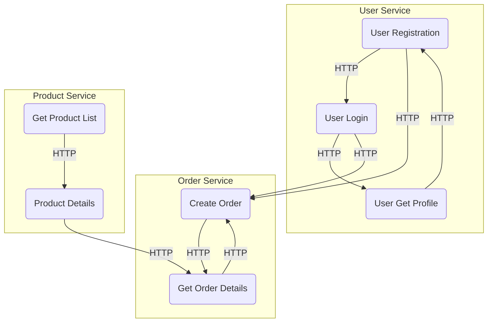

# Service-Oriented Architecture (SOA)

### **Definition**

Service-Oriented Architecture (SOA) is an architectural style that allows software components to communicate and cooperate as services. This approach focuses on creating reusable, loosely coupled, and interoperable services.

### **Advantages**

* **Modularity**: SOA promotes modularity by breaking down complex systems into smaller, self-contained services that can be developed, deployed, and maintained independently.
* **Reusability**: Services in SOA can be reused by multiple applications, reducing redundancy and promoting code efficiency.
* **Scalability**: SOA allows for scalability by enabling the addition or removal of services based on system requirements.
* **Interoperability**: SOA facilitates communication between multiple systems and platforms, enabling seamless integration of disparate applications.
* **Flexibility**: SOA provides flexibility in terms of technology stack, allowing different services to use different languages, protocols, and platforms.

### **Disadvantages**

* **Increased complexity**: Implementing SOA requires additional effort for service discovery, coordination, and management, which can result in increased complexity and overhead.
* **Performance overhead**: Since SOA relies on network communication between services, there can be a performance overhead compared to tightly coupled architectures.
* **Lack of standardization**: SOA lacks a unified standard, leading to variations in implementation and interoperability challenges between different service providers.
* **Governance challenges**: Managing and governing a large number of services in an SOA architecture can be challenging, requiring proper governance and service lifecycle management.
* **Integration complexities**: Integrating existing legacy systems with a service-oriented architecture may involve significant effort and complexity.

### **Suitable Use Cases**

* Enterprises with complex, distributed systems that require seamless integration and interoperability between various applications and platforms.
* Applications that require flexibility and modularity, with the ability to change or add new services without impacting the entire system.
* Systems that demand reusability, where services can be shared and utilized across multiple applications.
* Cloud-based applications that need to scale dynamically, adding or removing services based on demand.

### **Non-suitable Use Cases**

* Simple applications with a limited scope and minimal integration requirements.
* Applications that prioritize tight coupling and performance over flexibility and loose coupling.
* Time-critical applications where the additional overhead of service communication can impact performance.
* Existing monolithic applications that do not require integration with other services or systems.
* Projects with limited resources and tight budgets, as implementing and maintaining an SOA architecture can be resource-intensive.
